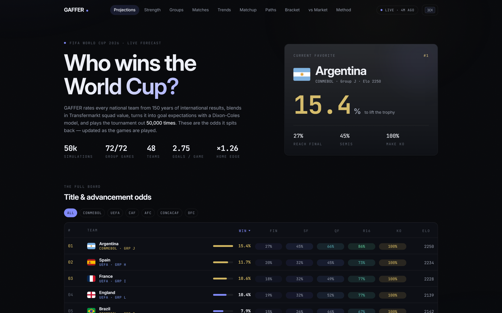
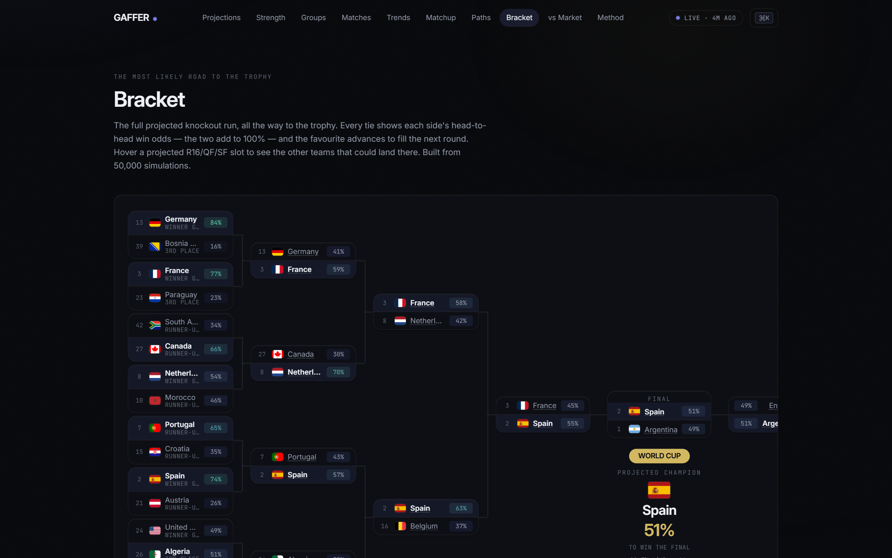
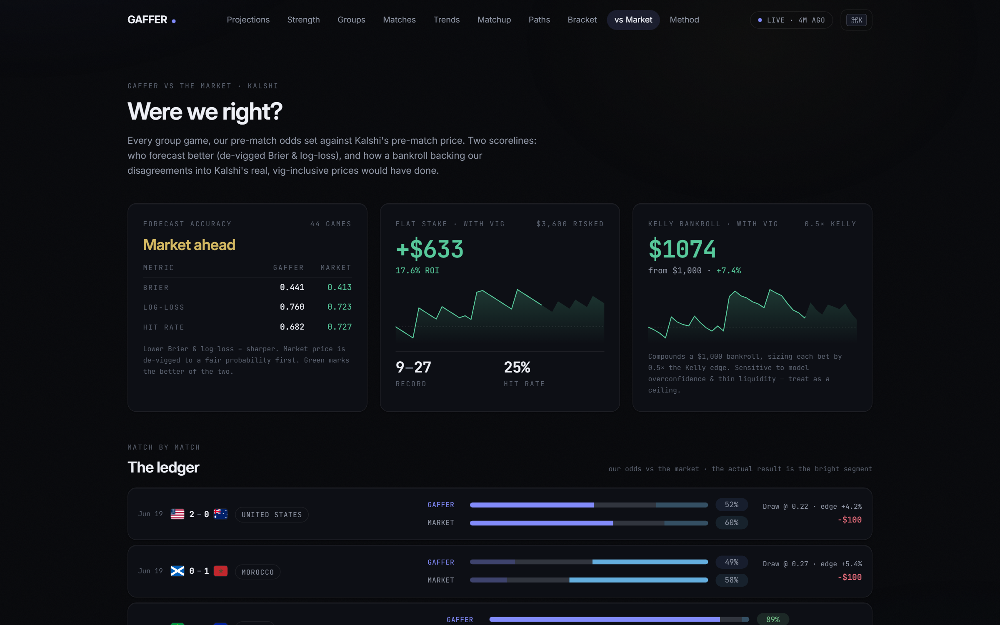
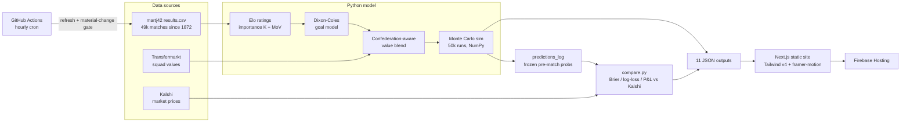

# GAFFER — World Cup 2026 Forecast Engine

**Live site → [gaffer-wc26.web.app](https://gaffer-wc26.web.app)**

[](https://github.com/ARJUNVARMA2000/wc-2026-gaffer/actions/workflows/ci.yml)
[](https://github.com/ARJUNVARMA2000/wc-2026-gaffer/actions/workflows/update.yml)
[](https://github.com/ARJUNVARMA2000/wc-2026-gaffer/actions/workflows/deploy.yml)
[](LICENSE)


A self-refreshing forecast model for the 2026 FIFA World Cup that **publishes frozen
pre-match predictions and grades itself against Kalshi, a real prediction market** —
Brier score, log-loss, and an honest vig-inclusive betting P&L (flat-stake and
half-Kelly). Elo ratings → Dixon-Coles goal model → Transfermarkt squad-value blend →
50,000-simulation NumPy Monte Carlo, rebuilt every hour through the tournament, in the
spirit of Michael Caley's **PADDLIN'** (Double Pivot / Expecting Goals).

<!-- screenshots: captured from the live site; regenerate after major UI changes -->
| Projections | Bracket | vs Market |
| --- | --- | --- |
|  |  |  |

## Architecture



The site is a fully static export, but it doesn't feel static: every browser polls
`meta.json` (~2 min, visibility-aware, CDN-friendly cache-busting) and hot-swaps the
page's data in place when a new deploy lands — tables FLIP-reorder, bars and odds tween
from old to new values, no reload.

## How the model works

1. **Data** — every men's international since 1872 (~49k matches) from the public
   [martj42/international_results](https://github.com/martj42/international_results)
   dataset. Finished 2026 World Cup games flow straight in; upcoming fixtures stay open.
2. **Ratings** — Elo updated per match (`ΔR = K·G·(W−E)`); `K` scales with match
   importance, `G` is a log-dampened margin-of-victory ("paddlin'") multiplier. Home
   advantage applied at non-neutral venues.
3. **Goal model** — a time-weighted multiplicative Poisson fit gives each team attack
   and defense ratings; Dixon-Coles corrects low-scoring draws and yields full scoreline
   distributions.
4. **Squad value** — each team's rating is nudged toward its Transfermarkt market value,
   weighted more in cross-confederation games and less within a confederation
   (PADDLIN's confederation blend).
5. **Simulation** — the real 2026 bracket (12 groups → top 2 + 8 best thirds → Round of
   32 → … → Final) is played out 50,000 times, vectorized with NumPy. Played matches are
   fixed; only the rest are simulated. Outputs: title odds, round-by-round advancement,
   group qualification odds, per-match odds and projected scores.

Full write-up on the live [Method page](https://gaffer-wc26.web.app/method).

## Accuracy tracking (the honest part)

- **Frozen predictions** — every unplayed match's win/draw/loss probabilities are
  snapshotted before kickoff (`predictions_log.json`) and never touched again once the
  match is played. No hindsight grading.
- **vs the market** — the [vs Market page](https://gaffer-wc26.web.app/accuracy) scores
  GAFFER against Kalshi's de-vigged prices on Brier score and log-loss, and runs a
  betting ledger against Kalshi's *raw asks* (vig included): flat-stake and half-Kelly,
  bets only when the model's edge clears a threshold.
- **Backtests** (`python -m wc_model.backtest`):
  - Walk-forward calibration on 8,136 matches since 2018: log-loss **0.887 vs 1.05**
    baseline, 60% accuracy, calibrated within ~0.03 across probability buckets.
  - Squad-value A/B on a 2024–26 holdout: the Transfermarkt blend **improves** log-loss
    (0.8479 vs 0.8533) out-of-sample.
  - Pre-WC2022 face check: eventual champion **Argentina #2**, runner-up **France #8**.

## Pages

| Page | What it shows |
| --- | --- |
| [Projections](https://gaffer-wc26.web.app/) | Sortable title & advancement odds with a round-by-round heatmap |
| [Strength](https://gaffer-wc26.web.app/strength) | Elo, round-robin score, attack/defense scatter |
| [Groups](https://gaffer-wc26.web.app/groups) | 12 live group cards with qualification odds |
| [Matches](https://gaffer-wc26.web.app/matches) | Results, upcoming W/D/L odds, projected scores, biggest upsets |
| [Trends](https://gaffer-wc26.web.app/trends) | Title-race and Elo history over the tournament |
| [Matchup](https://gaffer-wc26.web.app/h2h) | Any-vs-any Dixon-Coles simulator, computed in the browser |
| [Paths](https://gaffer-wc26.web.app/paths) | Likely knockout opponents and draw difficulty per team |
| [Bracket](https://gaffer-wc26.web.app/bracket) | Projected knockout tree with per-match win % and hover alternatives |
| [vs Market](https://gaffer-wc26.web.app/accuracy) | Model vs Kalshi accuracy + betting P&L ledger |
| [Method](https://gaffer-wc26.web.app/method) | Methodology, credits |

## Run it locally

### Model (Python 3.12)

```bash
cd model
python -m venv .venv && . .venv/Scripts/activate     # Windows: .venv\Scripts\activate
pip install -r requirements.txt

# generate all projections (downloads latest results, runs 50k sims, writes JSON)
PYTHONPATH=src python -m wc_model.pipeline --download --sims 50000
```

Outputs land in `model/data/output/` and are mirrored to `web/public/data/`.

Dev loop:

```bash
pip install -r requirements-dev.txt
pytest -q            # 127 tests, ~1s, no network
ruff check src tests
```

### Website (Next.js 16)

```bash
cd web
npm install
npm run dev          # http://localhost:3000 — live-refresh polls every 5s in dev
npm run build        # static export → out/
```

## Live operations

`.github/workflows/update.yml` runs **hourly**: re-pull results → recompute → 50k sims →
then a **material-change gate** (`wc_model.material_diff`) diffs the data JSONs against
HEAD with volatile timestamp fields stripped — if only timestamps moved, the run ends
with no commit and no deploy. Every 6th hour is a *full* run that also re-scrapes
Transfermarkt (politely) and refreshes Kalshi quotes. Deploys go to Firebase Hosting;
`ci.yml` gates every push/PR with ruff + pytest + lint + typecheck + build, and
`deploy.yml` ships a push to `main` only after its CI run passes — deploying the exact
commit CI validated.

Production-hardening war stories, preserved as workflow comments: Node is pinned to
22.22.3 (22.23.0 ships an undici regression that breaks firebase-tools auth with
"Premature close"), and firebase-tools is pinned rather than `@latest` (npm once flipped
`latest` to a tarball that hadn't propagated).

## Design notes

The UI is a dark, Linear/Stripe-inspired system: semantic design tokens in a Tailwind v4
`@theme` block, Inter with optical sizing, one indigo accent, hairline borders + soft
elevation, glass surfaces, and a shared framer-motion vocabulary (stagger variants,
FLIP reorders, spring bars, a ⌘K command palette). Every animation respects
`prefers-reduced-motion`; tables announce sort state; hover-only interactions have
keyboard equivalents. Data changes from the live poller animate old → new everywhere.

## Credit

Methodology adapted, with thanks, from Michael Caley & Mike Goodman's
[Double Pivot](https://www.youtube.com/@DoublePivotPod) series and Caley's
[Expecting Goals](https://www.expectinggoals.com) PADDLIN' write-ups. Data:
[martj42/international_results](https://github.com/martj42/international_results),
Transfermarkt (squad values), Kalshi (market prices), flagcdn (flags).

A forecast, not a guarantee.
